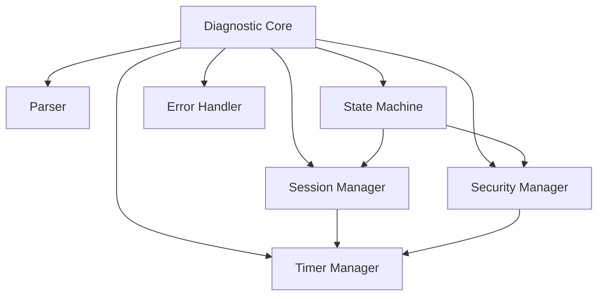

# CANT Programming Language

## Overview
CANT is a specialized programming language and runtime system designed for automotive diagnostics and therapeutic operations. It provides a robust platform for developing diagnostic tools, testing procedures, and vehicle system analysis applications.

## Features

### Core Language
- Strong static typing system
- First-class support for CAN bus operations
- Built-in diagnostic primitives
- Real-time execution capabilities
- Automotive-specific standard library
- Error handling with diagnostic context

### Runtime System
- Memory Management
  - Configurable heap and pool allocators
  - Memory protection and corruption detection
  - Memory leak tracking
  - Automatic defragmentation

- Network Stack
  - Multi-protocol support (CAN, Ethernet, WiFi, Cellular)
  - Protocol abstraction layer
  - Buffer management
  - Connection pooling

- Diagnostic System
  - Real-time logging
  - Error tracking
  - Performance monitoring
  - System state analysis

### Development Tools
- CANT Compiler
- Interactive Debugger
- Network Protocol Analyzer
- Memory Profiler
- Performance Analysis Tools

## Building from Source

### Prerequisites
- CMake 3.12 or higher
- C11 compliant compiler
- Python 3.8+ (for build scripts)
- Flex and Bison (for parser generation)

### Build Instructions
#### Clone the repository
```bash
git clone https://gitlab.com/fayssal.me/cant
```
#### Build the project
```bash
mkdir build
cd build
cmake ..
make
```
### Build 
```bash 
cmake --build .
```

## Run tests
```bash
ctest --output-on-failure
```
### Platform Support
- Linux (primary development platform)
- Windows (via MinGW or MSVC)
- macOS
- Embedded Systems (with appropriate toolchain)

## Usage Example
```cant
// Basic diagnostic script
program VehicleCheck {
// Configure CAN interface
can_interface can0 {
bitrate: 500000,
mode: normal
}
// Define diagnostic routine
diagnostic_routine check_engine() {
// Send diagnostic request
message = can_send(0x7DF, [0x02, 0x01, 0x00]);
// Wait for response
response = can_receive(timeout: 100ms);
// Analyze response
if (response.valid()) {
log_info("Engine status: {}", response.data);
} else {
log_error("No response from ECU");
}
}
// Main entry point
main() {
// Initialize system
init_diagnostic_session();
// Run diagnostic routine
check_engine();
// Cleanup
close_diagnostic_session();
}
}
``` 

## Contributing
1. Fork the repository on GitLab
2. Create a feature branch (`git checkout -b feature/amazing-feature`)
3. Commit your changes (`git commit -m 'Add amazing feature'`)
4. Push to the branch (`git push origin feature/amazing-feature`)
5. Create a Merge Request

### Development Workflow
- Create issues for new features and bugs
- Use feature branches for development
- Follow merge request templates
- CI/CD pipeline must pass
- Code review required for all changes

### Coding Standards
- Follow C11 standard
- Use snake_case for functions and variables
- Use PascalCase for types and structures
- Include comprehensive unit tests
- Document all public APIs

## Authors
- Fayssal CHOKRI <fayssal.chokri@gmail.com>

## Status
Current Version: 1.0.0-alpha

# Diagnostic System

## Overview
The diagnostic system provides a comprehensive implementation of UDS (Unified Diagnostic Services) with support for:
- Session management
- Security access control
- Message parsing and formatting
- State machine management
- Timer management
- Error handling

## Architecture


## Components

### Diagnostic Core (
